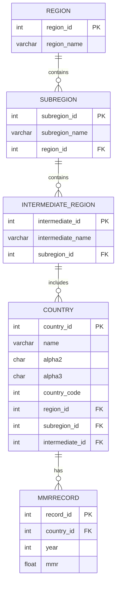

# SE2025 Final Exam — Maternal Mortality Ratio (MMR) System  
### Student: 張梓榆 (M11405103)

This repository contains all required components for the final exam of  
**Software Engineering in Construction Information Systems 2025**.

The project implements a fully functional **three-tier web application** for analyzing  
**Maternal Mortality Ratio (MMR)** data, using:

- Normalized relational database (3NF)
- SQL ETL pipeline
- Express.js + HTML + CSS + HTMX
- Docker & Docker Compose

---

# 🗂 Repository Contents

```
SE2025_Final_M11405103/
│
├── app/
│   ├── server.js               # Main Express application
│   ├── views/                  # HTML (EJS-based) views
│   ├── public/                 # CSS / JS / static assets
│   └── Dockerfile
│
├── data/
│   ├── data1.csv               # MMR facts
│   └── data2.csv               # Country metadata
│
├── mysql-init/
│   └── ETL.sql                 # Database creation + ETL pipeline
│
├── docker-compose.yml          # Deployment configuration
├── README.md                   # This document
└── ERDiagram.png (optional)
```

---

# 📌 ER Model (3rd Normal Form)

The ER model used in this project follows the 1st, 2nd, and 3rd normal forms.



---

# 🧪 Tasks Completed

## ✔ Task 1 — GitHub Repository
- Repository contains all required exam materials.
- README.md included.
- ER model, SQL ETL, source code, and Docker files all committed.
- At least one commit per task.

---

## ✔ Task 2 — Database Design & Normalization
- Fully normalized database (3NF).
- No many-to-many relationships.
- Includes more than 4 entities (required for full score).
- ER model provided above.

---

## ✔ Task 3 — SQL & ETL (ETL.sql)
`mysql-init/ETL.sql` contains:
- All `CREATE TABLE` statements.
- ETL pipeline:
  - Load from CSV files.
  - Clean & transform data.
  - Insert into normalized schema.
- All SQL statements include comments explaining purpose.

---

## ✔ Task 4 — Three-Tier Web Application (8 Features)

All 8 features required by the exam are implemented:

### 1️⃣ View MMR by Country  
Dropdown → Show all MMR records (year DESC).

### 2️⃣ MMR by Subregion & Year  
Dropdown (subregion + year) → Show all countries ordered by MMR (ASC).

### 3️⃣ Region Avg MMR  
Dropdown (region + year) → Show each subregion and its average MMR.

### 4️⃣ Keyword Search (HTMX Live Search)  
Type text → partial match → return latest MMR.

### 5️⃣ Add Next-Year MMR  
Detect max year + 1 → insert new MMR record.

### 6️⃣ Update Existing MMR  
Country → available years (HTMX) → update selected record.

### 7️⃣ Delete MMR by Year Range  
Country → start year → end year → delete multiple rows.

### 8️⃣ Custom Feature — Trend Chart  
Interactive MMR trend visualization using Chart.js + year slider.

---

## ✔ Task 5 — Deployment with Docker

The system can be started using only two commands:

```bash
git clone https://github.com/zhangmia20020902-lab/SE2025_Final_M11405103.git
cd SE2025_Final_M11405103
docker compose up --build
```

The app will be available at:

👉 **http://localhost:3000**

---

## ✔ Task 6 — Git Push  
All commits pushed to GitHub before the deadline.

---

# 🚀 How to Run the Application

### 1. Clone repository
```bash
git clone https://github.com/zhangmia20020902-lab/SE2025_Final_M11405103.git
```

### 2. Enter project
```bash
cd SE2025_Final_M11405103
```

### 3. Start using Docker
```bash
docker compose up --build
```

### 4. Open browser
👉 http://localhost:3000

---

# 📘 Technology Stack

| Layer | Technology |
|------|------------|
| Front-end | HTML, CSS, HTMX |
| Back-end | Node.js (Express) |
| Database | MySQL 8 (Docker container) |
| Visualization | Chart.js |
| Deployment | Docker Compose |

---

# 👩‍🎓 Student Information
- **Name:** 張梓榆  
- **Student ID:** M11405103  
- **Course:** Software Engineering in Construction Information Systems  
- **Semester:** 2025  

---

# 🎉 End of README


